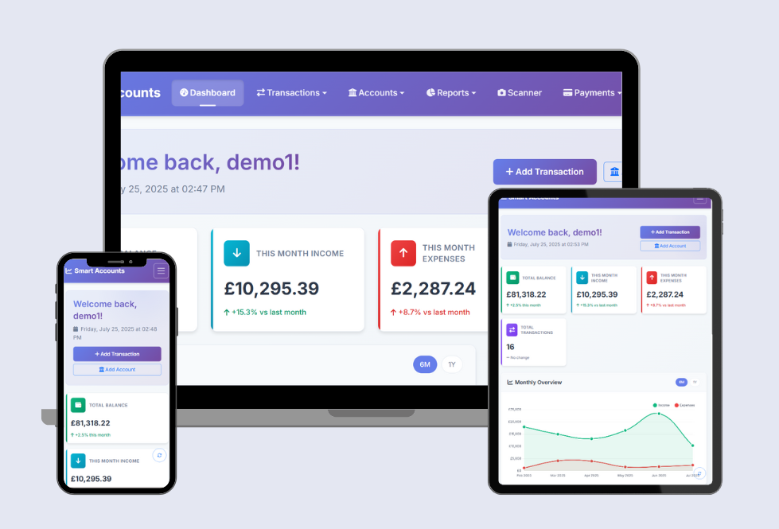

# Smart Account Management

A Django-based web application for managing personal finances, accounts, transactions, budgets, and categories with a modern dashboard UI. Includes Google Vision OCR-powered receipt scanning, Stripe payment integration, and easy cloud deployment on Heroku. All uploaded receipts and files are stored securely in Google Cloud Storage (GCS).

### 🔗 Try the live demo here: [[Live-link](https://smart-account-management-3922a24234c3.herokuapp.com/dashboard/)]

.png>)

## Table of Contents

- [Features](#features)
- [Getting Started](#getting-started)
  - [Prerequisites](#prerequisites)
  - [Installation](#installation)
- [Usage](#usage)
- [Demo Account](#demo-account)
- [OCR Receipt Scanning](#ocr-receipt-scanning)
- [Stripe Payment Integration](#stripe-payment-integration)
- [Heroku Deployment](#heroku-deployment)
- [Google Cloud Storage Integration](#google-cloud-storage-integration)
- [File Structure](#file-structure)
- [Entity Relationship Diagram](#entity-relationship-diagram)
- [Website Performance Using Lighthouse](#website-performance-using-lighthouse)
- [Website Responsiveness](#website-responsiveness)
- [Future Enhancements](#%F0%9F%9A%80-future-enhancements)
- [Author](#author)

## Features

- User authentication and registration
- Add, edit, and view accounts
- Record income, expense, and transfer transactions
- Edit and delete transactions directly from the transaction list
- Dashboard with monthly overview charts and statistics
- Category breakdown and budget progress
- Responsive design with Bootstrap
- Data visualization using Chart.js
- **Receipt OCR:** Scan receipts and bills using Google Vision OCR for automatic transaction entry
- **Stripe Payments:** Secure online payments and account funding via Stripe
- **Google Cloud Storage:** Store uploaded receipts and files securely in GCS
- **Heroku Deployment:** One-click cloud deployment for easy access
- **Heroku Postgres:** Cloud database for scalable storage

## Getting Started

- Python 3.8+

1.  cd Smart_Account_Management

2.  Create and activate a virtual environment:
    ```sh
    python -m venv venv
    venv/Scripts/activate  # On Windows
    source venv/bin/activate  # On macOS/Linux
    ```
3.  Install dependencies:
    ```sh
    pip install -r requirements.txt
    ```
4.  Configure Stripe:

    - Set your Stripe API keys in environment variables or `settings.py`
    - See [Stripe Docs](https://stripe.com/docs)
    - Enable the Google Vision API in your Google Cloud project
    - See [django-storages GCS docs](https://django-storages.readthedocs.io/en/latest/backends/gcloud.html)

    

5.  Create a superuser (optional):
    ```sh
    python manage.py createsuperuser
    ```
6.  Collect static files:
    ```sh
    python manage.py collectstatic --noinput
    ```
7.  Run the development server:
    ```sh
    python manage.py runserver
    ```

## Usage

- Access the app at `http://localhost:8000/`
- Register a new user or log in
- Add, edit, and delete accounts and transactions
- Edit or delete transactions directly from the transaction list
- Scan receipts to auto-fill transactions (Google Vision OCR)
- Fund accounts or pay bills using Stripe
- View dashboard analytics and manage budgets

## Demo Account

You can use the following demo credentials to explore the app without registering:

- **Username:** `demo1`
- **Password:** `demo1234`

## OCR Receipt Scanning

- Upload a photo or PDF of a receipt
- The app uses Google Vision OCR to extract transaction details
- Review and confirm auto-filled transaction data

## Stripe Payment Integration

- Securely fund your account or pay bills
- Stripe handles payment processing and security
- Configure your Stripe keys in the environment

## Heroku Deployment

1. Install the Heroku CLI: https://devcenter.heroku.com/articles/heroku-cli
2. Login and create a new Heroku app:
   ```sh
   heroku login
   heroku create your-app-name
   ```
3. Add Heroku Postgres add-on for database:
   ```sh
   heroku addons:create heroku-postgresql:hobby-dev
   ```
   - Update your Django `DATABASES` config to use the Heroku Postgres URL from `heroku config:get DATABASE_URL`
4. Set environment variables (Stripe keys, Django secret key, GCS bucket, etc.):
   ```sh
   heroku config:set STRIPE_SECRET_KEY=your_key
   STRIPE_PUBLISHABLE_KEY=your_key
   DJANGO_SECRET_KEY=your_secret
   GS_BUCKET_NAME=your-gcs-bucket
   GS_CREDENTIALS=your-gcs-credentials.json
   ```
5. Deploy:
   ```sh
   git push heroku main
   heroku run python manage.py migrate
   heroku run python manage.py collectstatic --noinput
   ```
6. Open your app:
   ```sh
   heroku open
   ```

## Google Cloud Storage Integration

- Store uploaded receipts and files in Google Cloud Storage buckets
- Configure your bucket name and credentials in environment variables
- Update Django `DEFAULT_FILE_STORAGE` to use the GCS backend
- See [django-storages GCS docs](https://django-storages.readthedocs.io/en/latest/backends/gcloud.html)

-

## File Structure

```
Smart_Account_Management/
├── accounts/
│   ├── __init__.py
│   ├── admin.py
│   ├── apps.py
│   ├── categories.py
│   ├── forms.py
│   ├── models.py
│   ├── tests.py
│   ├── urls.py
│   ├── views.py
│   ├── migrations/
│   └── templates/
├── payments/
│   ├── __init__.py
│   ├── admin.py
│   ├── apps.py
│   ├── models.py
│   ├── tests.py
│   ├── urls.py
│   ├── views.py
│   ├── migrations/
│   └── templates/
├── scanner/
│   ├── __init__.py
│   ├── admin.py
│   ├── apps.py
│   ├── forms.py
│   ├── models.py
│   ├── ocr_service.py
│   ├── serializers.py
│   ├── tests.py
│   ├── urls.py
│   ├── views.py
│   ├── migrations/
│   └── templates/
├── SmartAccounts/
│   ├── __init__.py
│   ├── asgi.py
│   ├── settings.py
│   ├── urls.py
│   └── wsgi.py
├── static/
├── media/
├── receipts/
├── db.sqlite3
├── manage.py
├── requirements.txt
├── Procfile
├── README.md
└── ... (other files)
```

## ✅Entity Relationship Diagram


## ✅Website Performance Using Lighthouse

### For Laptop


### For Phone


## ✅Website Responsiveness



## 🚀 Future Enhancements

- **Invoice Scanning:** Add support for scanning and extracting data from invoices, similar to receipt OCR.
- **Export Data:** Allow users to export their accounts, transactions, and budgets to CSV files for backup or analysis.
- **Import Data:** Enable importing accounts, transactions, and budgets from CSV files for easy migration or bulk entry.
- **Budget Planning:** Add tools for users to plan, track, and visualize their budgets more effectively.

### Other Easy-to-Implement Ideas

- **Dark Mode:** Add a toggle for dark/light theme to improve user experience.
- **Password Reset:** Allow users to reset their password via email.
- **Profile Page:** Let users update their profile info and change their password.
- **Monthly Summary Email:** Send users a monthly summary of their spending and budgets.

## Author

Dimplektech

---
